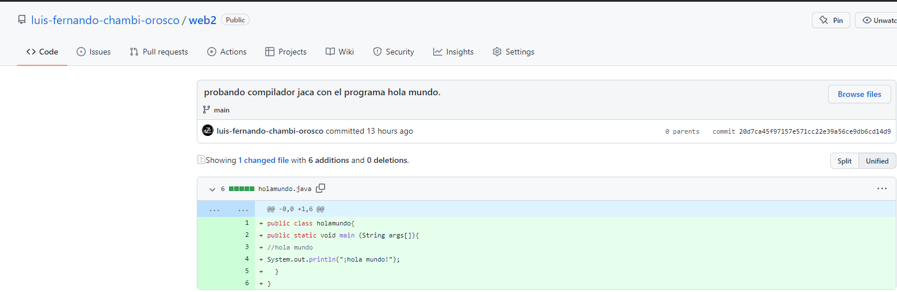
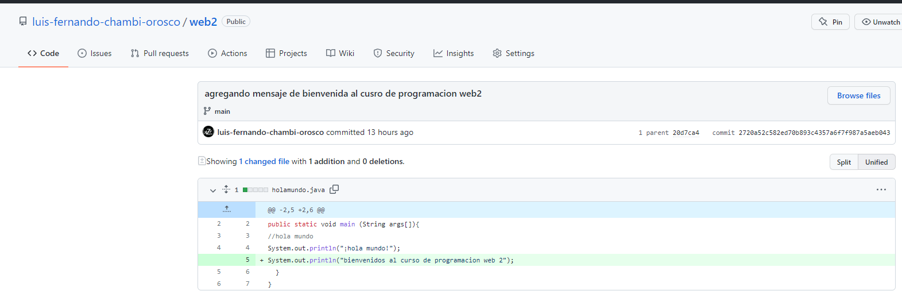
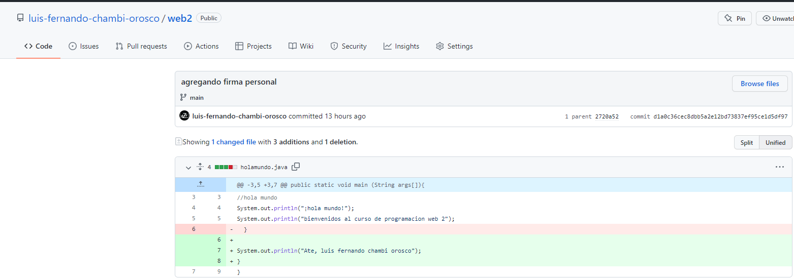

<table>
<theader>
<tr><th colspan="6">INFORMACIÓN BÁSICA</th></tr>
</theader>
<tbody>
<tr><td>ASIGNATURA:</td><td colspan="5">Programación Web 2</td></tr>
<tr><td>TÍTULO DE LA PRÁCTICA:</td><td colspan="5">Git - GitHub</td></tr>
<tr>
<td>NÚMERO DE PRÁCTICA:</td><td>01</td><td>AÑO LECTIVO:</td><td>2022 A</td><td>NRO. SEMESTRE:</td><td>III</td>
</tr>
<tr>
<td>FECHA DE PRESENTACION:</td><td>29-Abr-2022</td><td>HORA DE PRESENTACION</td><td>29-Abr-2022</td><td>DURACIÓN:</td><td>04 horas</td>
</tr>
<tr>
<td>ESTUDIANTES:</td><td colspan ="3"><li>Luis Ayben Chahua Charca</li><li>Luis Fernando Chambi Orosco</li> </td><td>NOTA:</td><td >20</td>

</tr>
<tr><td colspan="6">DOCENTES:
<ul>
<li>Richart Smith Escobedo Quispe</li>
</ul>
</td>
</<tr>
</tdbody>
</table>

## SOLUCION y RESULTADOS
## 1 SOLUCION DE EJERCICIOS /PROBLEMAS 
Creacion  de un repositorio llamado web2 

Se creo 3 commits 
- Primer commit 
Probando java con el programa holamundo 
<td></td>

- Segundo commit 
Agregando mensaje de bienvenida al curso de programacion web2 
<td></td>

- Tercer commit 
Agregando una firma personal 
<td></td>

##  2 SOLUCION DEL CUESTIONARIO 
- Git
- GitHub

## 3 CONCLUSIONES
- C.c Diseña responsablemente sistemas, componentes o procesos para satisfacer necesidades dentro de restricciones realistas: económicas, medio ambientales, sociales, políticas, éticas, de salud, de seguridad, manufacturación y sostenibilidad.
- C.m Construye responsablemente soluciones siguiendo un proceso adecuado llevando a cabo las pruebas ajustada a los recursos disponibles del cliente.
- C.p Aplica de forma flexible técnicas, métodos, principios, normas, estándares y herramientas de ingeniería necesarias para la construcción de software e implementación de sistemas de información.

## RETROALIMENTACION GENERAL 
- 

## REFERENCIAS Y BIBLIOGRÁFIA 
- https://guides.github.com/
- https://git-scm.com/book/es/v2

